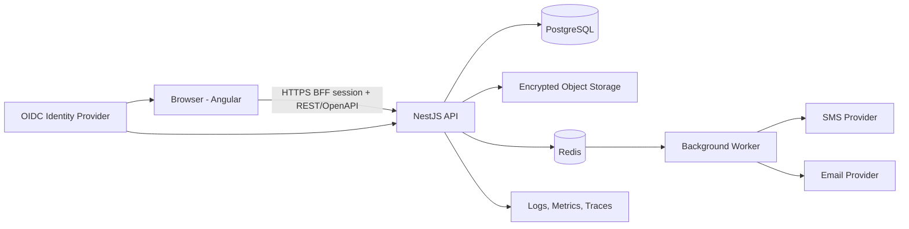

# Dentix — Software Design Document

Standard architecture reference for building Dentix, structured on the [arc42](https://arc42.org) template. This is the single entry point a developer opens to understand the system and the order to build it in.

**This document is an entry point and does not replace authoritative specifications.** Conflict resolution follows `docs/document-control.md`; an Accepted ADR cannot be overridden by a stale requirement, summary, or release plan.

---

## 1. Introduction and Goals

### 1.1 Product summary

Dentix is a custom dental practice management system for one Iranian dental office: Farsi-only (fa-IR), RTL UI, Jalali-only date presentation (ADR-012), rial/toman money, and Gregorian/UTC + integer-rial canonical storage. It covers patient registry, scheduling, clinical charting, treatment planning, treatment journeys, follow-up, lab orders, recall, patient ledger, documents, communications, and fixed reports.
Full detail: `01-product/01-readme.md`, `01-product/02-product-vision.md`.

### 1.2 Explicitly out of scope

Insurance/claims, general accounting, payroll, e-prescribing, native imaging drivers, card vaulting, AI diagnosis, marketing automation, native mobile apps, multi-location billing, custom report builder. A feature only enters scope if it (1) supports a defined single-office workflow, (2) does not reintroduce an excluded domain indirectly, and (3) has acceptance criteria, an owner, and a measurable outcome.
Full detail: `01-product/03-scope-and-exclusions.md`.

### 1.3 Quality goals (ranked)

1. **Correctness of money and dates** — bigint rial storage, exact toman conversion, Gregorian/UTC canonical with Jalali presentation; zero silent rounding, zero float arithmetic on money.
2. **Auditability** — signed clinical records and posted ledger entries are immutable; every correction is a new event (amendment/reversal), never an in-place edit.
3. **Usability for one office's real workflow** — fast enough for daily front-office and clinical use; RTL-first, not RTL-retrofitted.
4. **Security of patient data** — OIDC+MFA, endpoint and object-level authorization, encryption at rest/in transit, full audit trail.
5. **Maintainability by a small team** — modular monolith over microservices, strict module boundaries, explicit mappers, CI-enforced architecture rules.

### 1.4 Stakeholders

| Role | Concern |
|---|---|
| Dentist / providers | Clinical safety, charting speed, signed-record integrity |
| Reception / office manager | Scheduling throughput, ledger accuracy, day-end reconciliation |
| Patients | Correct appointments/receipts in Persian, data privacy |
| Developer(s) implementing this system | An unambiguous, buildable spec — this document |

---

## 2. Constraints

### 2.1 Technical constraints (fixed, not up for reinterpretation)

| Layer | Choice |
|---|---|
| Frontend | Angular 22 + Angular Material/CDK + custom dental design system. No PrimeNG/NG-ZORRO mixing. |
| Backend | NestJS on Node.js 24 LTS — modular monolith, not microservices (ADR-001) |
| Database | PostgreSQL 18 |
| Jobs/cache | Redis + BullMQ |
| Object storage | S3-compatible, encrypted |
| API | REST + OpenAPI at `/api/v1`; Angular client generated/type-checked from the contract |
| Auth | OIDC + MFA with server-side BFF session; provider per ADR-007 |

Pin exact dependency versions; update through review only. Full detail: `CLAUDE.md`, `04-architecture/01-system-architecture.md`.

### 2.2 Organizational / regulatory constraints

- One domestic Iranian office; foreign SaaS dependencies (IdPs, cloud, SMS) may be unreliable or restricted — hosting (ADR-010) and provider choices (ADR-007, ADR-011) must assume this.
- The Real-Data Authorization Gate is required before any patient-data extract, migration rehearsal, parallel ledger, third-party processing, or pilot.
- Code, schema, API fields, config keys, error codes, logs, and comments are English. Product-authored Farsi prose lives in UI resources or configurable DB translations; user-entered demographic and clinical text is stored exactly as entered.

### 2.3 Open decisions that block implementation in their area

ADR-006 (persistence/ORM), ADR-007 (OIDC provider), ADR-008 (Jalali library), ADR-009 (print pipeline), ADR-010 (hosting), and ADR-011 (messaging provider) are **Proposed**, not Accepted. Do not build the affected area until each is accepted — see §9 and Release 0.5 in §11.

---

## 3. Context and Scope

### 3.1 Business context

```
                    ┌─────────────────────────┐
   Reception/        │                         │
   Dentist/  ───────►│         Dentix          │◄─────── Patients (via
   Office manager     │   (single-office PMS)   │          printed docs,
                    │                         │          SMS/email only —
                    └───────┬────────┬────────┘          no patient portal)
                            │        │
                  ┌─────────┘        └─────────┐
                  ▼                             ▼
          OIDC Identity Provider        SMS / Email Provider
          (self-hosted, ADR-007)        (domestic Iranian, ADR-011)
```

No patient-facing portal or app exists in v1; all patient interaction is in-person, by phone, or via one-way SMS/email/printed documents.

### 3.2 Technical context

External systems: OIDC identity provider (auth), SMS/email provider (reminders, via queued worker jobs), S3-compatible object storage (documents, generated PDFs). No insurance clearinghouse, no payment gateway, no imaging-device integration — all explicitly excluded.

---

## 4. Solution Strategy

| Decision | Why | ADR |
|---|---|---|
| Modular monolith, one Postgres DB, transactional outbox | Strong transactional consistency across scheduling/clinical/finance; simpler ops for one office; microservices buy nothing here | ADR-001 |
| Angular Material/CDK as the only UI foundation | Accessibility/bidi/overlay primitives come for free; avoids conflicting component suites | ADR-002 |
| Farsi-only, RTL-only, Jalali-only presentation in v1 | Halves the UI test matrix (no runtime language/direction switching); office only needs Persian | ADR-012 (supersedes ADR-003) |
| Gregorian/UTC + integer-rial canonical storage, always | Keeps the data layer boring and internationalization-ready even though the UI is Farsi-only | ADR-005, ADR-012 |
| Immutable signed clinical records / posted ledger entries | Auditability and reproducibility; corrections are new events, not edits | ADR-004 |
| Domain → Application → Infrastructure → Presentation layering, explicit mappers, no ORM leakage | Keeps business rules independent of NestJS/ORM/HTTP; testable in isolation | `04-architecture/03-module-boundaries.md` |

---

## 5. Building Block View

### 5.1 Module list (level 1)

The authoritative bounded-context/module catalog, data ownership, and dependency map is `04-architecture/07-context-module-map.md`. Odontogram/perio remain inside Clinical; follow-up remains inside Treatment Continuity; Reporting is read-only; Integrations contains adapters rather than domain policy.

### 5.2 Internal module layout (level 2)

Every module uses the same four-layer layout — `domain/` → `application/` → `infrastructure/` → `presentation/` — with one-way dependencies (domain imports nothing framework-specific). The authoritative directory tree, dependency rules, controller/use-case rules, and code-quality rules are `04-architecture/03-module-boundaries.md`; they are not duplicated here.

### 5.3 Data model (level 3)

The logical data model assigns every table to one owning module and defines tenant integrity, cardinalities, immutability, money/date contracts, concurrency, retention, outbox/idempotency, and core constraints. Full detail: `04-architecture/04-data-model.md`. Cross-module event contracts are `04-architecture/10-event-catalog.md`. Both describe the full target design; `07-plans/00-build-sequencing.md` governs what's built in which release.

---

## 6. Runtime View

### 6.1 System topology



### 6.2 Use-case execution pattern

Every write path follows the single canonical controller/use-case pattern in `04-architecture/03-module-boundaries.md`: controllers only validate and dispatch; the use case loads aggregates, authorizes with object context, invokes domain behavior, commits one owning module's writes plus outbox/audit facts in one transaction, and returns a transport-independent result.

### 6.3 Example event reaction

`ProcedureCompleted` commits the clinical fact first. Treatment Planning, Treatment Continuity, and Patient Finance react idempotently through the outbox. Failures are visible, retryable, and reconciled; they never roll back the clinical fact. Full detail: `04-architecture/08-transaction-event-semantics.md`.

---

## 7. Deployment View

### 7.1 Deployable units

`web` (Angular static bundle) · `api` (NestJS modular monolith) · `worker` (same codebase or separate process for queued jobs) · PostgreSQL · Redis · Object storage · Reverse proxy / ingress.

### 7.2 Environments

Local development → shared development/integration → staging (fictional or approved-anonymized data only) → production. Production and non-production use fully separate accounts, secrets, databases, object stores, and identity clients.

### 7.3 Deployment sequence

Backup, then a backward-compatible (expand-and-contract) migration, then API/worker, then the web
bundle, then smoke tests and monitoring — rollback requires the schema to stay backward
compatible. **Where this actually runs is not yet decided — ADR-010 (hosting model) is Proposed
and blocks any real deployment.**
Full detail (the authoritative step sequence, migration policy, and rollback rules):
`06-operations/01-deployment.md`, `06-operations/02-backup-recovery.md`, `06-operations/03-monitoring.md`.

---

## 8. Crosscutting Concepts

### 8.1 Money

Canonical unit is the Iranian rial, stored as signed bigint (`amount_rial`). Toman is display/input only: 1 toman = exactly 10 rials, converted at the application boundary, never with JS floats. API values are decimal strings converted to `bigint`. Every displayed amount carries an explicit rial/toman label; conversions never silently round. Multi-currency is excluded from v1. ADR-005.

### 8.2 Dates and calendar

UTC instants and Gregorian ISO dates are canonical everywhere in the DB and API. The UI presents and accepts **Jalali only** (ADR-012) through one calendar-adapter interface — Gregorian display is a removed toggle in v1, not a deleted capability, so adding it back later is a new adapter, not a rewrite. Office timezone is explicit `Asia/Tehran` (IANA), never inferred from the browser. Jalali strings are never persisted as domain dates. ADR-005, ADR-008 (adapter library, still Proposed), ADR-012.

### 8.3 Language, RTL, and future i18n hedge

v1 ships Farsi-only, RTL-only, with no runtime language/direction switch (ADR-012, supersedes ADR-003). Despite that, every UI string lives in externalized translation resources (never hardcoded Persian in components), CSS uses logical properties (never hardcoded left/right), backend returns locale-neutral error codes, and the calendar/currency stay behind adapters — because the product's stated future direction is possible internationalization, and these hedges are what keep that a bounded change instead of a rewrite. Chronology, dental anatomy, and tooth orientation never mirror in RTL. The Latin patient-name field is retained; dynamic Latin names/codes/phones inside Persian text use Unicode bidi isolation.
Full detail: `03-ux/03-bilingual-rtl-guidelines.md`, `04-architecture/06-configuration-catalog.md`, ADR-012.

### 8.4 Immutability

Signed clinical records and posted ledger entries are never updated or deleted. Clinical corrections are amendments; financial corrections are reversals plus new entries. Draft records remain normally versioned/concurrency-controlled until signed or posted. ADR-004.

### 8.5 Configuration layers

| Layer | Where | Example |
|---|---|---|
| 1. Deployment | env/secret manager, never in DB or sent to frontend | DB connection, OIDC client secret |
| 2. Office | DB, admin UI, every change audited | timezone, money display unit, procedure fees |
| 3. User preference | per user, low-risk | default calendar view, density |
| 4. Frontend bootstrap | public JSON, fetched pre-render, no secrets ever | locale, dir, timezone, API base URL |

Deliberately **not** configuration (changing these means changing code + a replacement ADR): canonical storage rules, domain state machines, immutability rules, the 1 toman = 10 rial ratio.
Full detail: `04-architecture/06-configuration-catalog.md`.

### 8.6 Authorization and state transitions

Every mutation requires both endpoint-level and object-level authorization checks. Signing, exports, and refunds require recent authentication. Sensitive actions produce audit events. State changes go through explicit transition/action endpoints (`POST .../transitions`, `.../sign`, `.../reversals`) — never a generic `PATCH` for signed notes, appointment lifecycle, lab readiness, journey stages, or ledger corrections.
Full detail: `01-product/04-roles-and-permissions.md`, `05-quality/01-security-privacy.md`, `04-architecture/05-api-guidelines.md`.

---

## 9. Architecture Decisions

| ADR | Decision | Status |
|---|---|---|
| 001 | Modular monolith, not microservices | Accepted |
| 002 | Angular Material/CDK as sole UI foundation | Accepted |
| 003 | Runtime Persian/English localization | **Superseded by ADR-012** |
| 004 | Immutable signed clinical / posted financial records | Accepted |
| 005 | Iranian calendar (Jalali/Gregorian) and rial/toman representation | Accepted |
| 006 | Persistence and migration tooling (ORM choice) | **Proposed — accept during Release 0.5** |
| 007 | OIDC identity provider | **Proposed — accept during Release 0.5** |
| 008 | Jalali calendar library / Angular DateAdapter | **Proposed — accept during Release 0.5, needs round-trip proof** |
| 009 | PDF/print pipeline | **Proposed — accept during Release 0.5, needs dummy-receipt proof** |
| 010 | Hosting and operations model | **Proposed — blocking gate before any deployment** |
| 011 | SMS/email provider | **Proposed — accept during Release 2 planning** |
| 012 | Farsi-only UI, Jalali-only presentation | Accepted — supersedes ADR-003, amends ADR-005's presentation clauses |
| 013 | OIDC-backed backend-for-frontend session | Accepted |
| 014 | Defer OIDC provider-token persistence (amends ADR-013) | **Proposed — accept when Release 1 session work starts** |

A decision that contradicts an Accepted ADR requires a replacement ADR — do not code around it. Full ADR text: `04-architecture/adr/`.

---

## 10. Quality Requirements

### 10.1 Mandatory test categories (every feature touching dates or money)

- Jalali↔Gregorian round-trip tests (leap years, Nowruz, Esfand 29/30, year boundaries).
- Rial/toman exactness property tests (reversals return the prior balance, conversions never silently round).
- Latin-name/mixed-script fixtures in list, print, and message tests (bidi isolation).

### 10.2 Test pyramid summary

Unit (domain transitions, money/date conversion, normalization, permission decisions) → Integration (repositories, Postgres constraints, outbox, OIDC, Redis jobs) → API contract (OpenAPI compatibility, authorization matrix, idempotency) → Component (Angular forms, custom schedule/odontogram/ledger controls) → End-to-end (critical Persian-language user journeys: register/search patient, schedule lifecycle, chart and sign an encounter, treatment plan → journey → lab order, procedure completion → charge → payment, print receipt).
Full detail: `05-quality/02-test-strategy.md`, `05-quality/03-acceptance-criteria.md`, `05-quality/04-definition-of-done.md`.

### 10.3 Security baseline

OIDC + MFA with a server-side BFF session, least-privilege endpoint+object authorization, recent-auth requirement for signing/export/high-risk finance actions, session-bound CSRF protection, TLS everywhere, encryption at rest, no PHI in logs/URLs/commits, and OWASP ASVS verification. Real data is prohibited until the Real-Data Authorization Gate is approved.
Full detail: `05-quality/01-security-privacy.md`.

---

## 11. Risks and Technical Debt

### 11.1 Highest-severity open risks (High likelihood × High impact, or vice versa)

| ID | Risk | Mitigation |
|---|---|---|
| R-03 | Sanctions/network restrictions block npm, Docker Hub, cloud, or foreign SaaS from Iran | Decide hosting early (ADR-010); prefer self-hostable OSS; local registry mirror |
| R-05 | Data migration quality: legacy spreadsheets/paper produce duplicates and wrong balances | R0 source inventory; migration spec (`02-requirements/09-data-migration.md`); rehearsal + reconciliation before pilot |
| R-06 | Immutability design flaw only found after real data exists | Property-based tests in R5; parallel run before cutover |
| R-07 | Key-person dependency on a small team | Docs-as-code (this repo); ADR for every decision; runbooks in R6 |
| R-11 | Pilot fatigue running two systems in parallel | Short scoped parallel window; visible reception wins first |
| R-13 | Real-data authorization is not approved when R5/R6 work needs it | Prohibit extracts and use fictional data until the gate closes |

Full register (16 risks, owners, triggers): `07-plans/risks.md`. Reviewed at every release boundary.

### 11.2 Remaining readiness work

Stable requirement IDs, confirmed NFRs/client environment, Iranian holiday ownership, complete migration mapping, and named approvers remain Release 0 outputs. ADR-006 through ADR-011's Proposed status in §9 and the register in `07-plans/risks.md` are the current source of truth for what remains open.

---

## 12. How to Build This — Implementation Order

Releases run R0 → R0.5 (walking skeleton) → R1 … R7. The authoritative release scope is `01-product/06-product-roadmap.md`; the per-release plan files and exit gates are indexed in `07-plans/README.md`; execution happens as testable vertical slices per `08-implementation/01-workflow.md`. A release does not start before the previous release's exit gate is signed off.

**First concrete steps for a developer starting today:**
1. Review the ADR table in §9 for Proposed decisions and `07-plans/risks.md` for open risks, in priority order.
2. Accept ADR-010 (hosting) — it shapes everything operational and gates deployment. A recommended decision is drafted in `04-architecture/adr/adr-010-hosting-operations.md`.
3. Run Release 0 discovery, including the migration source inventory and NFR confirmation.
4. Build the Release 0.5 walking skeleton via `08-implementation/02-slices-release-0.5.md`, accepting ADR-006/007/008/009 through their drafted acceptance checklists — the highest-leverage risk reduction in the whole roadmap.
5. Only then start Release 1 feature work. §5–§8 describe the full target architecture; `07-plans/00-build-sequencing.md` scopes what Release 1 actually builds toward it versus what waits for a later release.

---

## 13. Glossary

The authoritative domain glossary is `01-product/07-glossary.md`; definitions are not duplicated here.

---

*Version 0.5.0 · Baseline 2026-08-06.*
